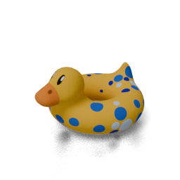

# Watertight Mesh

Common computer graphics triangle meshes that are (trying to be):

1. Watertight.
2. Centered at the origin.
3. Scaled to a unit box.
4. Heading +Y and facing +Z (default camera can be looking at (0,0,0) from (1,1,1)).
5. Small to medium file size.
6. Isotropic.

We provide both fine and coarse `.ply` mesh with only vertices and faces for all meshes. We provide `.obj` mesh with UV coordinates and `.png` texture for meshes with texture.

## Gallery

| Name | Link | C | F | #V | #F | Source |
|:---:|:---:|:---:|:---:|:---:|:---:|:---:|
| Armadillo | [[coarse.ply]](data/armadillo/coarse.ply) [[fine.ply]](data/armadillo/fine.ply) |  |  | 3k (32k) | 5k (64k) | [Stanford](http://graphics.stanford.edu/data/3Dscanrep) |
| Bunny | [[coarse.ply]](data/bunny/coarse.ply) [[fine.ply]](data/bunny/fine.ply) |  |  | 3k (41k) | 5k (81k) | [Stanford](http://graphics.stanford.edu/data/3Dscanrep) |
| Dragon | [[coarse.ply]](data/dragon/coarse.ply) [[fine.ply]](data/dragon/fine.ply) |  |  | 3k (46k) | 6k (91k) | [Stanford](http://graphics.stanford.edu/data/3Dscanrep) |
| Happy | [[coarse.ply]](data/happy/coarse.ply) [[fine.ply]](data/happy/fine.ply) |  |  | 3k (48k) | 7k (97k) | [Stanford](http://graphics.stanford.edu/data/3Dscanrep) |
| Lucy | [[coarse.ply]](data/lucy/coarse.ply) [[fine.ply]](data/lucy/fine.ply) |  |  | 3k (33k) | 6k (67k) | [Stanford](http://graphics.stanford.edu/data/3Dscanrep) |
| Statue | [[coarse.ply]](data/statue/coarse.ply) [[fine.ply]](data/statue/fine.ply) |  |  | 3k (54k) | 6k (108k) | [Stanford](http://graphics.stanford.edu/data/3Dscanrep) |
| XYZ Dragon | [[coarse.ply]](data/xyz_dragon/coarse.ply) [[fine.ply]](data/xyz_dragon/fine.ply) |  |  | 3k (32k) | 5k (63k) | [Stanford](http://graphics.stanford.edu/data/3Dscanrep) |
| Blub | [[coarse.ply]](data/blub/coarse.ply) [[fine.ply]](data/blub/fine.ply) [[texture.obj]](data/blub/texture.obj) [[texture.png]](data/blub/texture.png) |  |  | 2k (27k) | 3k (54k) | [Keenan Crane](https://www.cs.cmu.edu/~kmcrane/Projects/ModelRepository#blub) |
| Bob | [[coarse.ply]](data/bob/coarse.ply) [[fine.ply]](data/bob/fine.ply) [[texture.obj]](data/bob/texture.obj) [[texture.png]](data/bob/texture.png) |  |  | 2k (38k) | 5k (76k) | [Keenan Crane](https://www.cs.cmu.edu/~kmcrane/Projects/ModelRepository#bob) |
| Spot | [[coarse.ply]](data/spot/coarse.ply) [[fine.ply]](data/spot/fine.ply) [[texture.obj]](data/spot/texture.obj) [[texture.png]](data/spot/texture.png) |  |  | 2k (38k) | 5k (77k) | [Keenan Crane](https://www.cs.cmu.edu/~kmcrane/Projects/ModelRepository#spot) |
| Nefertiti | [[coarse.ply]](data/nefertiti/coarse.ply) [[fine.ply]](data/nefertiti/fine.ply) |  |  | 3k (38k) | 5k (76k) | [Keenan Crane](https://www.cs.cmu.edu/~kmcrane/Projects/ModelRepository/#nefertiti) |

### Notes

- `C` renders `coarse.ply`. `F` renders `fine.ply` when there is no `texture.obj`.
- `#V` means the number of vertices with format `Coarse (Fine)`.
- `#F` means the number of faces with format `Coarse (Fine)`.
- More on the way.

## Acknowledgements

Many thanks to the original creators for sharing these incredible meshes. The structure of this repository was mainly inspired by [common-3d-test-models](https://github.com/alecjacobson/common-3d-test-models). The meshes are processed by [MeshLab](https://www.meshlab.net/), [trimesh](https://trimesh.org/), and [PyMeshFix](https://pymeshfix.pyvista.org/index.html), and the renderings are created by [Blender](https://www.blender.org/).
